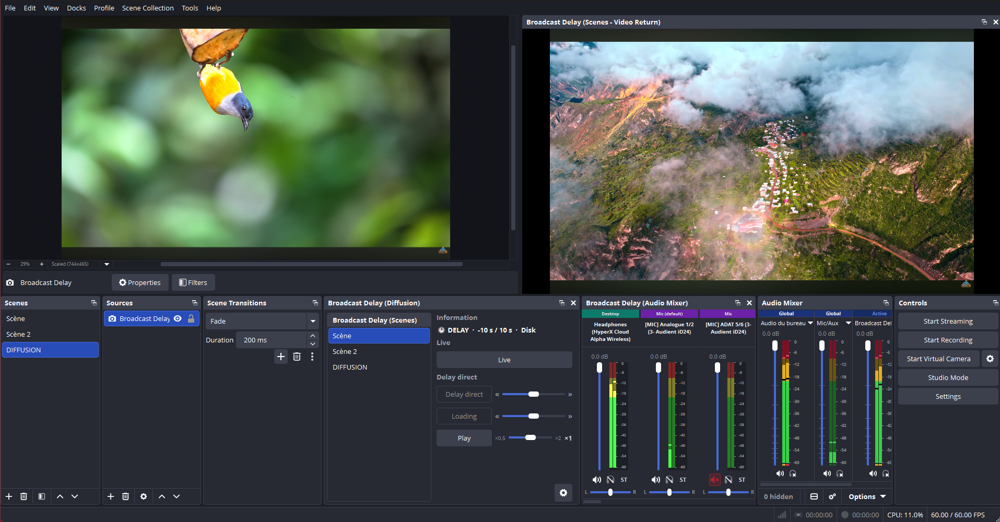
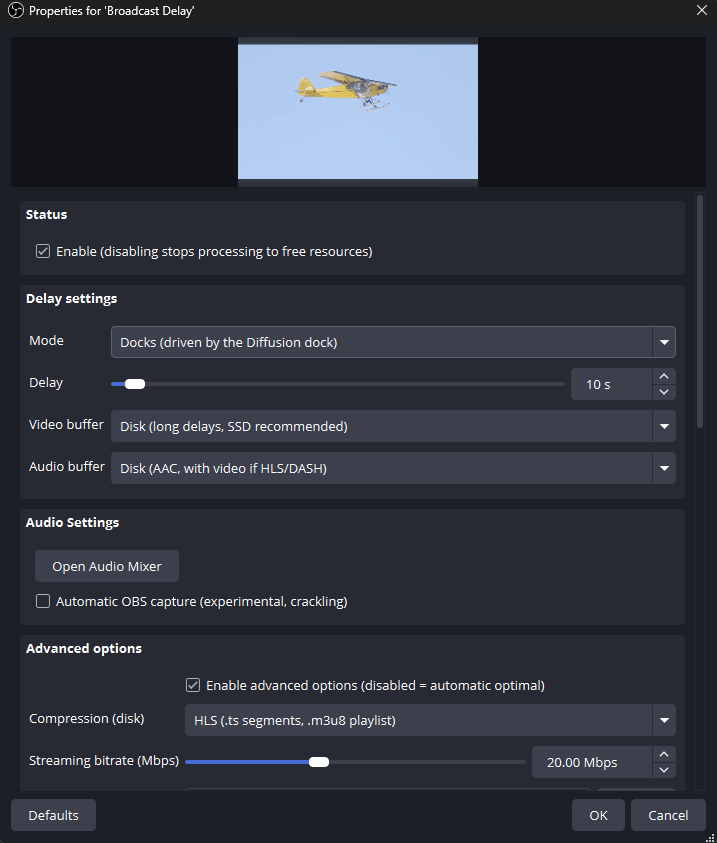

# Broadcast Delay - OBS plugin

Adds a delay to any source or scene in OBS. Good for a TV-style broadcast
delay, an instant replay feed, or just to sync a camera. Works on Windows
(OBS 32.1.2).

## Install

Run the installer and restart OBS. That's it.

## Tutorial: add a delay

1. In a scene, click **+** in Sources and pick **Broadcast Delay**.
2. Set the **Mode**: Source (delay one camera or game) or Scene (delay a whole scene).
3. Choose the **Target**: the source or scene to mirror.
4. Set the **Delay**, for example 5s, 30s, or several minutes.
5. Choose the **Video buffer**, which is where frames are stored:
   - RAM: good default.
   - VRAM: lowest latency, short delays only.
   - Disk: for long delays (minutes or hours).
6. Done. The source now plays everything a few seconds late, in sync with its audio.

## Tutorial: instant replay

1. Set the source **Mode** to Docks, then open View > Docks > Diffusion.
2. The dock lets you switch between Live and Delay with a crossfade, Pause, and
   play at x0.5, x1 or x2.
3. Drag the jog to scrub back into the buffer and replay a moment, then jump
   back to live.

## Tip

Every Broadcast Delay source keeps its own delay and buffer, saved with your
scene collection. Add several for different cameras.

## Pair with Broadcast Censure

Add the **Broadcast Censure** filter to a Broadcast Delay source to auto-blur
NSFW or gory content (and bleep bad audio) before the delayed feed airs.

Broadcast Censure: https://github.com/H0K0H/obs-broadcast-censure

## License

MIT. See [LICENSE](LICENSE).

https://github.com/H0K0H/obs-broadcast-delay

## Sponsors 💖

If this plugin helps you, you can support its development on Ko-fi:

The more stars and support the project gets, the more I keep improving it, so a
star or a small donation really makes a difference.

<!-- add sponsors here -->

## Used by

<!-- add users here -->
